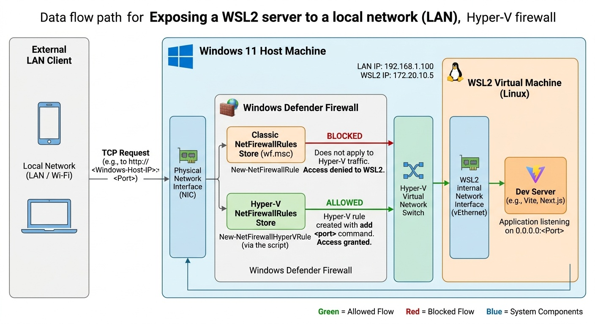

# WSL Hyper-V Firewall — Expose Your WSL2 Server to Your Local Network (LAN)

> **TL;DR:** Running a dev server in WSL2 (Vite, Next.js, Node, Python, Docker) and can reach it on `localhost:3000` but **not** from your phone or another computer on the same Wi-Fi? **Windows Defender Firewall (Hyper-V Firewall)** is blocking it. This script opens the port correctly with one command.

```powershell
# Run as Administrator
.\wsl-hyperv-firewall.bat add 5173
.\wsl-hyperv-firewall.bat list
.\wsl-hyperv-firewall.bat remove 5173
```



---

## The Problem It Solves

WSL2 does not run as a normal Windows process — it runs as a lightweight **Hyper-V VM** behind a virtual network adapter. That's why normal firewall rules under *Windows Defender Firewall > Inbound Rules* (`New-NetFirewallRule`) **do not** apply to WSL traffic.

Even if you:

* Run `npm run dev -- --host 0.0.0.0`
* Can access `http://localhost:5173` on the Windows host itself
* Have port forwarding enabled

...other devices on the same LAN will still get `Connection refused` / `Timeout`, because the **Hyper-V firewall isolation** blocks inbound traffic to the WSL container.

**The correct fix is `New-NetFirewallHyperVRule` with WSL's `VMCreatorId`** — exactly what this module does. It is not the same as `netsh advfirewall` or opening a port in the classic Windows Firewall.

### Are you searching for this?

This repo is the fix if you googled:

> WSL2 not accessible from LAN / local network • WSL2 port not reachable from another device • WSL firewall open port • Windows Defender Firewall WSL • Hyper-V firewall WSL • WSL2 Vite cannot access from phone • WSL2 Next.js LAN • `New-NetFirewallHyperVRule` WSL • WSL2 expose port to network • WSL bridge network firewall • WSL2 Windows firewall allow port • WSL2 connection refused from LAN

---

## What the Script Does

`wsl-hyperv-firewall.ps1` creates, lists, and removes **Hyper-V firewall rules** targeted at WSL:

| Command | What happens under the hood |
|---|---|
| `add <port> [TCP\|UDP]` | Resolves WSL's `VMCreatorId` (a unique GUID identifying the WSL Hyper-V engine, falling back to `{40E0AC32-46A5-438A-A0B2-2B479E8F2E90}`) via `Get-NetFirewallHyperVVMSetting` and creates a rule with `New-NetFirewallHyperVRule -Name WSL-HYPERV-<port>-<protocol> -Direction Inbound -Protocol <protocol> -LocalPorts <port>` (default `TCP`). Idempotent — prints `Port <port>/<protocol> is already configured.` if the rule exists. |
| `list` | Lists all rules named `WSL-HYPERV-*` via `Get-NetFirewallHyperVRule` |
| `remove <port> [TCP\|UDP]` | Removes the rule via `Remove-NetFirewallHyperVRule` (default `TCP`) |

*   **TCP (default), UDP supported, Inbound only** — TCP covers 99% of dev servers (HTTP / Vite / Webpack / Next / Nuxt / Django / Flask / FastAPI). Add UDP explicitly with `add <port> UDP` (e.g. DNS, QUIC, game server). Protocol is case-insensitive and part of the rule name.
*   **Naming convention:** `Name = WSL-HYPERV-<port>-<protocol>` (e.g. `WSL-HYPERV-5173-TCP`) and `DisplayName = WSL Hyper-V - Port <port> (<protocol>)` (e.g. `WSL Hyper-V - Port 5173 (TCP)`) makes rules easy to identify via `Get-NetFirewallHyperVRule`.
*   **Requires Administrator** — Hyper-V rules can only be changed elevated.
*   **Not visible in `wf.msc`:** This is intentional. Hyper-V firewall rules live in a separate store and do **not** show up in *Windows Defender Firewall with Advanced Security* (`wf.msc`). `wf.msc` only shows classic rules (`Get-NetFirewallRule` / `New-NetFirewallRule`). You verify Hyper-V rules with PowerShell only — see [Verification](#verification).

### Is it called "Windows Firewall" or "Windows Defender Firewall"?

Microsoft has renamed it several times: **Windows Firewall** → **Windows Defender Firewall** → **Windows Defender Firewall with Advanced Security** (`wf.msc`, the MMC console snap-in). In PowerShell the module is `NetSecurity`. In this repo it always refers to the built-in firewall in Windows 11 — and specifically its **Hyper-V extension** (`Get-NetFirewallHyperVRule` / `New-NetFirewallHyperVRule`), which operates on the virtual switch level, is separate from classic rules, and deliberately has **no GUI** in `wf.msc`.

---

## Why Are There Both a `.bat` and a `.ps1` File?

| File | Role |
|---|---|
| `wsl-hyperv-firewall.ps1` | **The actual logic.** The PowerShell script that talks to the firewall API. Can be run directly by developers who prefer PowerShell. |
| `wsl-hyperv-firewall.bat` | **Wrapper / launcher.** Forwards to PowerShell with `-ExecutionPolicy Bypass`. When started without arguments (double-click / `.lnk` shortcut) it shows help and prompts `Command >` interactively so the window doesn't close instantly; with arguments it runs directly via `%*`. |

There is a good reason for keeping both:

1.  **Bypasses `ExecutionPolicy`:** Windows blocks unsigned `.ps1` scripts by default (`Restricted` / `RemoteSigned` ExecutionPolicy). The `.bat` invokes PowerShell with `-ExecutionPolicy Bypass`, so you don't have to run `Set-ExecutionPolicy` or remember the flag every time.
2.  **Double-click and right-click > Run as administrator:** A `.ps1` cannot be elevated directly with UAC on double-click. With the `.bat` you can right-click → *Run as administrator* → it prompts `Command >` (e.g. type `add 3000`) in interactive mode — without opening PowerShell manually. With arguments (`.\wsl-hyperv-firewall.bat add 3000`) it runs directly without prompting.
3.  **Path handling (`%~dp0`):** Ensures the `.ps1` is found regardless of where you invoke the `.bat` from (same directory as the script), and `%*` forwards all arguments 1:1.
4.  **Best of both worlds:** Power users can call the `.ps1` directly (`powershell -ExecutionPolicy Bypass -File .\wsl-hyperv-firewall.ps1 add 5173`), while everyone else just uses the `.bat` — same functionality, less friction.

> **Conclusion:** `.ps1` is the engine, `.bat` is the key that makes the engine easy to start as admin without PowerShell hassle.

> **Tip: Want auto-UAC without right-clicking every time? Create a `.lnk` shortcut.**
> A `.lnk` can store the "Run as administrator" flag, so double-clicking it triggers the UAC prompt automatically — unlike a `.bat` which you must right-click. The `.lnk` itself is not checked into git (binary file), you create it locally once. When double-clicked without arguments the `.bat` now stays open in interactive mode (`Command >`) instead of closing instantly:
>
> **Manual (30 seconds):**
> 1. Right-click `wsl-hyperv-firewall.bat` → **Create shortcut**
> 2. Right-click the new `wsl-hyperv-firewall.bat - Shortcut.lnk` → **Properties** → **Shortcut** → **Advanced…** → check **Run as administrator** → OK
> 3. (Optional) Rename to `wsl-hyperv-firewall.lnk` and pin to Start/Taskbar. Double-click → UAC → type `add 5173` or `list` → Enter. Leave empty + Enter to exit.
>
>
> This gives you the main benefit people expect from an `.exe` (auto-UAC + double-click) without losing transparency, without AV/SmartScreen warnings, and without needing to sign or recompile anything.

---

## Usage

### Requirements

*   Windows 10 / 11 with WSL2
*   PowerShell 5.1+
*   **Administrator privileges** (right-click → Run as administrator)

### 1. Open an elevated prompt

Right-click `wsl-hyperv-firewall.bat` → **Run as administrator**, or open PowerShell/Terminal as administrator.

### 2. Commands

```powershell
# Open a port for WSL on the LAN (example: Vite default 5173)
.\wsl-hyperv-firewall.bat add 5173
.\wsl-hyperv-firewall.bat add 3000
.\wsl-hyperv-firewall.bat add 8000
.\wsl-hyperv-firewall.bat add 5173 UDP  # UDP if needed (e.g. QUIC, DNS)

# Show what's open
.\wsl-hyperv-firewall.bat list

# Close a port again
.\wsl-hyperv-firewall.bat remove 5173
.\wsl-hyperv-firewall.bat remove 5173 UDP

# Help
.\wsl-hyperv-firewall.bat --help
```

Directly with PowerShell (same result):

```powershell
powershell -ExecutionPolicy Bypass -File .\wsl-hyperv-firewall.ps1 add 5173
powershell -ExecutionPolicy Bypass -File .\wsl-hyperv-firewall.ps1 add 5173 UDP
```

Ports must be `1-65535`, protocol `TCP` or `UDP` (case-insensitive, default `TCP`). `list` takes no extra arguments.

### 3. Don't forget to bind your dev server to `0.0.0.0`

The firewall rule is only half the fix. By default, most dev servers only listen on `localhost` (`127.0.0.1`), which only accepts internal connections from inside the same environment. Your server inside WSL must listen on `0.0.0.0` (all network interfaces) so external requests from LAN can reach it:

```bash
# Vite / Vue / SvelteKit
npm run dev -- --host 0.0.0.0 --port 5173

# Next.js
npm run dev -- -H 0.0.0.0 -p 3000

# Python
python -m http.server 8000 --bind 0.0.0.0
uvicorn main:app --host 0.0.0.0 --port 8000

# Node / Express: app.listen(3000, '0.0.0.0')
```

Then find your Windows IP with `ipconfig` and access `http://<WINDOWS-IP>:5173` from your phone or another PC on the same network.

---

## Verification

> **Important:** These rules will **not** appear in `wf.msc` (Windows Defender Firewall with Advanced Security). That GUI only shows classic rules (`Get-NetFirewallRule`). Hyper-V rules require PowerShell.

```powershell
# Check that the rule exists (Hyper-V store — not wf.msc)
Get-NetFirewallHyperVRule -Name "WSL-HYPERV-5173-TCP" | Format-List *

# List all WSL rules created by this script
.\wsl-hyperv-firewall.bat list
# or
Get-NetFirewallHyperVRule | Where-Object { $_.Name -like "WSL-HYPERV-*" } | Format-Table Name,DisplayName,Direction,Protocol,LocalPorts,Enabled -AutoSize

# Classic firewall will NOT show them — this returns nothing (expected):
Get-NetFirewallRule -DisplayName "WSL Hyper-V - Port 5173 (TCP)" -ErrorAction SilentlyContinue
```

---

## FAQ / Troubleshooting

**I can't find the rule in `wf.msc` — did it fail?** No, that's expected. `wf.msc` never shows Hyper-V rules. That's exactly why this script exists — there is no GUI for `New-NetFirewallHyperVRule`. Verify with `.\wsl-hyperv-firewall.bat list` or `Get-NetFirewallHyperVRule` instead. If you open a port with `New-NetFirewallRule` / `wf.msc` / `netsh advfirewall`, it still won't work for WSL2.

**Still not reachable from LAN?** Check in order: 1) Did you run as Administrator? 2) Is the server listening on `0.0.0.0` and not just `localhost`? (`ss -tulpn` inside WSL) 3) Is your router/AP blocking *client isolation* (a Wi-Fi feature that prevents devices on the same Wi-Fi network from communicating with each other)? 4) Do you have a third-party firewall/antivirus overriding Windows Firewall?

**Do I need to run `add` after every reboot?** No. `New-NetFirewallHyperVRule` is persistent — the rule survives reboots. Run `list` to verify.

**What is `VMCreatorId` and does it work across multiple WSL2 distros?** Yes. All WSL2 distributions (Ubuntu, Debian, Alpine, etc.) share the same underlying lightweight Hyper-V VM engine and virtual network adapter. The `VMCreatorId` is the unique GUID for that shared WSL2 engine. Opening a port applies to all your WSL2 distros at once, while ensuring the rule only targets WSL and not other Hyper-V virtual machines on your PC (such as Windows Sandbox or full Hyper-V VMs).

**TCP or UDP?** The script opens TCP inbound by default, which covers HTTP/HTTPS/WebSocket. For UDP (e.g. DNS, QUIC, game server) run `.\wsl-hyperv-firewall.bat add <port> UDP` — this creates a separate rule `WSL-HYPERV-<port>-UDP`. Same for removal: `remove <port> UDP`.

**Security?** Only open the ports you need and remove them with `remove <port>` when you're done. The rule opens only that specific port for the WSL VM, not the entire machine.

---

## Alternative (without this script)

Manually in PowerShell as admin:

```powershell
$creatorId = (Get-NetFirewallHyperVVMSetting | Where-Object { $_.Name -match "WSL|Linux" } | Select-Object -First 1).VMCreatorId
if (-not $creatorId) { $creatorId = "{40E0AC32-46A5-438A-A0B2-2B479E8F2E90}" }
New-NetFirewallHyperVRule -Name "WSL-HYPERV-5173-TCP" -DisplayName "WSL Hyper-V - Port 5173 (TCP)" -Direction Inbound -VMCreatorId $creatorId -Protocol TCP -LocalPorts 5173
```

This repo simply automates the above + `list`/`remove` + ExecutionPolicy handling.

---

## License

MIT — free to use.

---

*Built with AI assistance.*

*SEO keywords: WSL2 firewall, WSL expose port LAN, WSL2 local network access, Windows Defender Firewall Hyper-V rule, New-NetFirewallHyperVRule, WSL2 port forwarding Windows 11, Vite WSL2 network, WSL2 cannot be reached from LAN fix*
